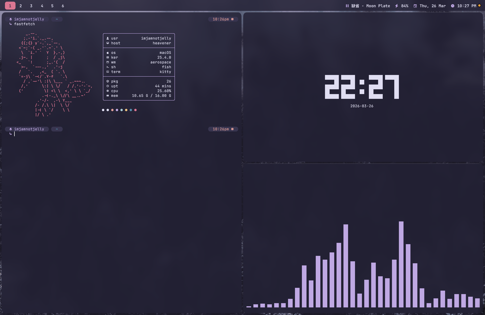
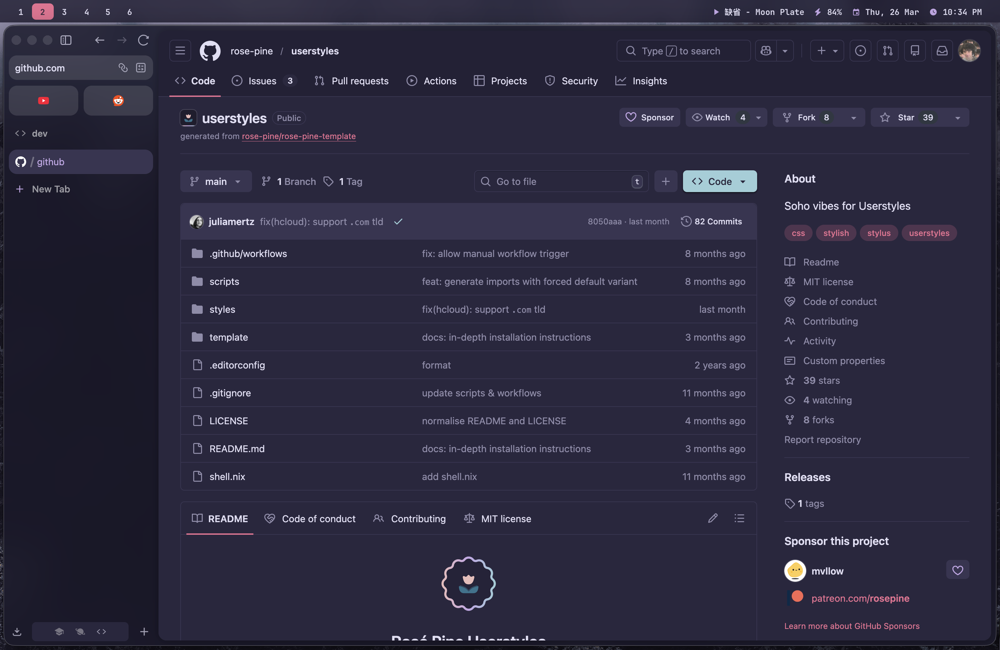
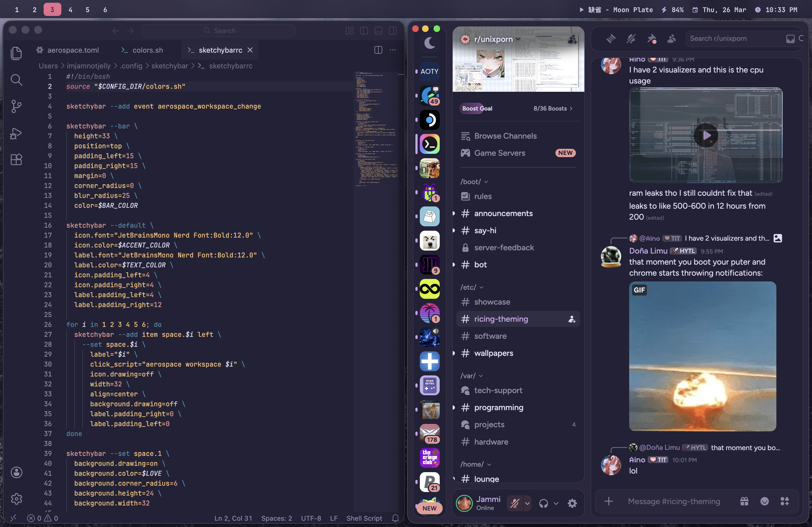

# dotfiles

macos pretty mode 🌹

### showcase

| | |
|:---:|:---:|
|  |  |
|  |  |

### installation
install yadm if you have
```bash
brew install yadm
```
clone the repo
```bash
yadm clone https://github.com/imjamnotjelly/dotfiles
```
*warning: this will overwrite existing files, please [read the docs](https://yadm.io/) before executing anything!*